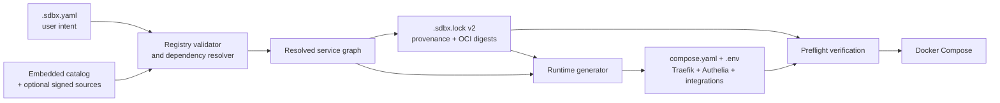
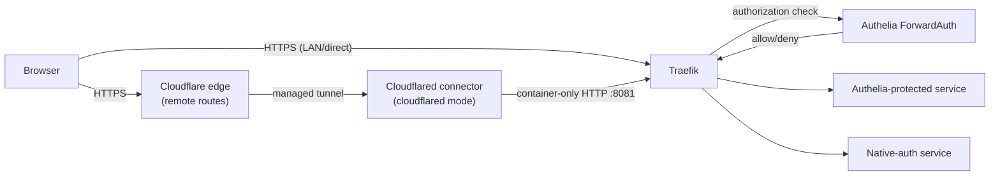
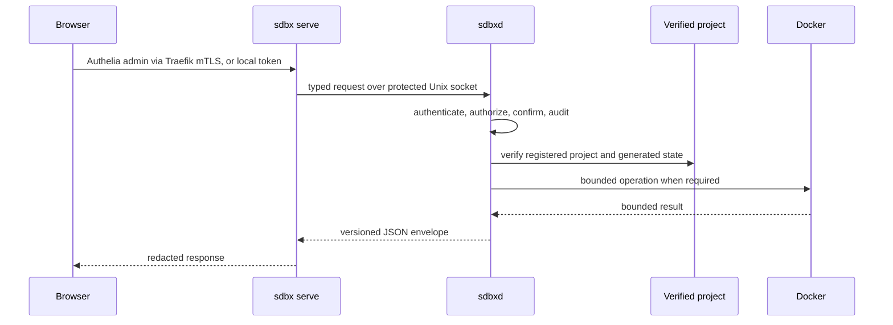

# Architecture

This document describes the implemented `v1.0.0-RC2` architecture. It is based on
the registry, resolver, generator, management broker, and service definitions in
this repository. It does not describe abandoned containerized-control-plane
experiments.

## Design goals

SDBX is built around five constraints:

1. One explicit project configuration is the source of user intent.
2. Service selection and dependencies resolve to a deterministic graph.
3. Definitions, images, and managed runtime files are pinned and verifiable.
4. Public routes have explicit TLS and authentication ownership.
5. Browser management cannot become arbitrary shell, filesystem, Docker, mount,
   or container-exec access.

The supported v1 host platform is Linux on `amd64`. Linux `arm64` remains a
cross-built compatibility target with immutable image coverage, but it does
not carry the full clean-host validation contract. Darwin is a development
target only.

## Control and generation pipeline



### Project intent

`.sdbx.yaml` records choices such as:

- domain, exposure mode, and routing strategy;
- media-server and addon selection;
- storage roots and container UID/GID;
- VPN policy and provider;
- service-specific route overrides.

It is user-editable, but generated runtime files are not independent sources of
truth. Typed mutations update the lock and runtime together. After a reviewed
manual intent change, inspect `sdbx lock diff` and run `sdbx lock`.
`sdbx generate` reconstructs runtime only when intent and the existing lock
already agree.

### Catalog and source trust

`services/embed.go` compiles the complete official catalog into the binary.
The generated [service reference](reference/services.md) is the authoritative
inventory. Core means that a definition participates in normal resolution;
conditions still decide whether services such as Gluetun, Cloudflared, Plex,
and Jellyfin are active.

The registry always includes the embedded catalog as its lowest-priority
fallback. There is no runtime dependency on `SDBX-Services` or another
companion repository.

Optional external catalogs are accepted only through an explicit source
configuration. A Git source must use:

- an immutable full commit ID;
- a verified OpenPGP or SSH signature;
- an expected signing-key fingerprint;
- an allowlist of container registries;
- explicit grants for privileged catalog permissions.

Git refreshes run with bounded child-process memory hints, one thread for
pack/index work, no terminal credential prompt, a two-minute wall-clock limit,
and 64 KiB of diagnostic output. The repository is fetched into a private
staging directory under per-source and aggregate cache quotas. SDBX rejects
oversized object stores, trees, files, entry counts, dirty worktrees, and
symlinks. Only a completely verified staging checkout is promoted atomically;
the active verified checkout is preserved on failure.

Before parsing, discovery separately bounds traversal entries, depth, tree
bytes, definition count, individual definition size, and aggregate definition
bytes. Only direct, `core/`, and `addons/` service layouts are accepted, so
discovery and loading cannot disagree about which file belongs to a service.

Local sources are a development escape hatch and cannot enter a release lock
without `--allow-local-sources`.

### Resolution graph

`internal/registry/resolver.go`:

1. lists definitions across configured sources;
2. selects core candidates and explicitly enabled addons;
3. evaluates configuration conditions;
4. validates the selected complete definition against its source trust policy;
5. resolves required and conditional dependencies recursively;
6. computes a topological installation order.

Source priority selects one complete definition; the resolver has no secondary
partial-definition merge layer. Replacing an embedded identity requires the
exact declared and granted `service-override:NAME` permission. Project
`services` intent can customize only routing strategy, subdomain, or path and
is validated separately. Every definition has one explicit activation
selector, and every conditional field uses the bounded v1 expression set.
Unknown expressions evaluate false defensively and are rejected by validation.
A required dependency that is missing or disabled is a graph error rather than
an omitted edge. A graph containing an invalid definition, missing dependency,
dependency cycle, unsafe route, ungranted permission, or invalid network
placement is not eligible for generation.

The same graph drives Compose, routes, dashboard entries, integration targets,
status, diagnostics, and management impact previews. These consumers should
not maintain separate handwritten service lists.

### Lock v2

`.sdbx.lock` records:

- configuration and catalog digests;
- source types, commits, trust grants, and definition digests;
- the dependency installation order;
- service definition versions;
- OCI image digests and selected Linux platform digests;
- digests for security-sensitive generated files.

Normal verification reuses the digests already present in the lock; it does not
silently refresh mutable tags. Explicit lock or update commands are the only
paths that resolve new image digests.

`sdbx up` verifies both the project lock and the recorded runtime-file digests
before invoking Compose. Missing, modified, oversized, or symlinked managed
files fail closed.

### Runtime generation

`internal/generator` renders only from the verified configuration, graph, and
lock. Managed outputs include:

- `compose.yaml`;
- `.env`;
- Authelia access policy;
- Traefik static configuration and dynamic middleware;
- Unpackerr connection metadata and file-backed Arr API-key copies when
  enabled;
- the Cobalt API key map when enabled;
- supported integration configuration.

Cloudflare mode does not generate a local Cloudflared ingress file. Tunnel-token
connectors are remotely managed, so `sdbx tunnel routes` derives the
Cloudflare-side Published application mappings from the same verified graph
without pretending that a local file owns them.

Initialization is transactional. It stages the complete managed tree, validates
it, journals destinations, promotes files atomically, and can recover or roll
back an interrupted write. Later regeneration uses restricted atomic file
writes and preserves user-owned application state.

## Runtime network model

SDBX generates four named Compose networks:

| Network | Purpose | Important constraints |
| --- | --- | --- |
| `sdbx_edge` | Tunnel-to-proxy ingress | Reserved for Traefik and Cloudflared. |
| `sdbx_app` | Media and automation applications | General application traffic. |
| `sdbx_download` | Download clients and their routed ingress | Contains Gluetun and download-scoped services. |
| `sdbx_management` | Sensitive management applications | Separate from the general application network. |

Traefik joins the route-bearing networks because it must reach the selected
backend for each route. Catalog validation requires a routed service to declare
the same network named in its Traefik route.

These bridges reduce accidental lateral reach. They are not a defense against a
compromised host, root account, Docker administrator, or container granted a
dangerous capability.

### Deterministic route discovery

Traefik uses only its file provider. SDBX renders every enabled router,
middleware, TLS policy, and internal backend URL from the same verified
resolution graph that produces Compose and the lock file. Regeneration updates
that file atomically when configuration or addons change.

No official container receives the Docker socket or a Docker API endpoint.
Catalog validation also rejects Docker-socket paths after template rendering,
so an external source cannot synthesize one through a template. qBittorrent is
the only special backend: while it shares Gluetun's network namespace, its
generated route targets `gluetun:8080`.

## Request routing



The tunnel branch exists only in `cloudflared` mode. The connector token
authenticates Cloudflared, while hostname-to-origin mappings remain in the
Cloudflare control plane. LAN and direct traffic arrive on Traefik's published
HTTPS entrypoint.

### Exposure modes

| Mode | Host ports | Browser transport | Certificate behavior |
| --- | --- | --- | --- |
| `lan` | `80`, `443` | HTTPS; HTTP redirects to HTTPS | Traefik serves its local/default certificate unless the operator installs a trusted one. |
| `direct` | `80`, `443` | HTTPS; HTTP redirects to HTTPS | Traefik obtains ACME certificates using the configured email. |
| `cloudflared` | None for web ingress | HTTPS at the Cloudflare edge | A remote Published application route sends traffic to Cloudflared, which reaches an unpublished, container-only Traefik entrypoint. |

Cloudflare Tunnel reduces inbound host exposure but adds Cloudflare as a trust
and availability dependency. It does not replace route authentication. SDBX
v1 supports Cloudflare's remote-managed token model only; it exposes an exact
route plan and verifies public reachability, but never claims that a connector
token can mutate Cloudflare account state.

### Routing strategies

Subdomain mode gives each routed service a hostname:

```text
https://jellyfin.media.example.net/
https://sonarr.media.example.net/
```

Path mode shares one hostname:

```text
https://media.example.net/jellyfin
https://media.example.net/sonarr
```

Each service definition declares whether path routing uses prefix stripping,
application-native base-path configuration, or a forced subdomain. Route
hostnames, paths, URLs, Traefik rules, Cloudflare route plans, dashboard
launcher links, and status output all use `internal/routing`; they must not be
reconstructed independently.

The Dashboard receives launcher presentation hints and active routes
through the same typed `/api/status` service model. It renders only routed
services that explicitly opt into `presentation.launcher`; stopped or
unhealthy entries remain visible as status cards but do not become fake
browser links. Internal workers such as Unpackerr never receive a launcher.

### Authentication ownership

Every routed service must declare one mode:

| Mode | Authentication owner | Generated behavior |
| --- | --- | --- |
| `admin-only` | Authelia plus the SDBX administrators group | ForwardAuth and an Authelia `group:admins` rule. |
| `protected` | Authelia | ForwardAuth with an authenticated-user policy. |
| `native-auth` | The application | Security headers only; no Authelia ForwardAuth. |
| `public` | No user-auth layer | Intentionally unauthenticated route, still with security headers. |

Generated Authelia rules use the typed `auth.factor` project setting. It
defaults to `one_factor` so an administrator can complete initial TOTP
enrollment. After enrollment, `sdbx config set auth.factor two_factor`
regenerates every ForwardAuth rule; restart Authelia and verify the boundary in
a fresh browser session.

Plex, Jellyfin, and other `native-auth` services must have their own
administrator accounts secured before exposure. The Authelia portal itself is
`public` because it is the login endpoint.

Sonarr, Radarr, Lidarr, Prowlarr, and Whisparr are deliberately layered: their
routes remain `admin-only`, so Traefik requires an Authelia administrator, and
each application also requires SDBX-managed Forms authentication from every source.
This prevents a compromised peer on a shared Docker network from bypassing the
edge policy. `sdbx integrate` reconciles the native account through the
service's authenticated API; API-key integrations remain independently
authenticated.

## Download VPN boundary

With VPN enabled:

```text
qBittorrent network_mode -> service:gluetun -> VPN tunnel -> internet
```

qBittorrent receives no independent network attachment or host ports. Its Web
UI and peer ports are owned by Gluetun's network namespace. If Gluetun is
unhealthy or loses its tunnel, Gluetun's firewall is the download kill-switch.

Without VPN, qBittorrent joins `sdbx_download` directly and publishes its peer
port. SDBX requires the operator to acknowledge this exposure with
`--allow-unprotected-downloads`; omission fails closed.

The VPN protects qBittorrent traffic, not the entire media stack. Automation
services normally remain on their assigned application networks.

## Management plane

The management plane has two processes:



### `sdbxd`

`cmd/sdbxd` is the root-owned host broker. It:

- registers exactly one absolute project directory;
- verifies the project before serving;
- creates a group-restricted Unix socket, broker token, and distinct browser
  console token;
- provisions the canonical public hostname and server-side console trust
  material into its private runtime directory;
- exposes the versioned `sdbx.management/v1` API;
- accepts only typed operations implemented by `management.Operator`;
- bounds request and response sizes and operation timeouts;
- cancels Docker log reads while stdout or stderr is still being streamed into
  memory if either reaches the 2 MiB management limit;
- writes an append-only JSONL audit log for mutations.

The API contains reads for summary, security, diagnostics, services, logs,
addons, settings, backups, and audit history. Mutations are limited to addon
changes, typed setting changes, encrypted backup operations, and stack
lifecycle actions. There is no generic command, path, Docker API, mount, or
container-exec method.

The static local client token represents an administrator with recent
authentication. Optional OIDC authorization is intended for other broker
clients: the daemon verifies issuer, signature, audience, expiry, subject,
groups, and `auth_time`. Mutations require `sdbx-admin`; high-impact mutations
also require recent authentication.

### `sdbx serve`

The Web UI:

- accepts a non-loopback listener only when the complete server certificate,
  client CA, and canonical public-host contract is configured;
- opens the packaged recovery HTTP listener only on loopback and only alongside
  the remote TLS listener;
- accepts the public Host only over a verified `sdbx-traefik` client
  certificate with an Authelia user in `admins`;
- sends restrictive browser security headers and no-store caching;
- discloses no credential or management data through unauthenticated content;
- requires either that remote identity contract or the protected local browser
  token on every management API request;
- accepts that token from the URL fragment printed by `sdbx console`, removes
  it from the address bar, and retains it only for the browser session;
- talks only to the Unix-socket broker client;
- redacts internal broker errors from browser responses.

Run this process under an unprivileged account that can read the broker client
token and access the broker group. The current CLI does not enforce its numeric
user ID, so service installation must enforce that boundary.

The Dashboard is not shipped as an in-cluster addon and has no `--in-cluster`
escape hatch. Traefik reaches the unprivileged host process through Docker's
host-gateway alias using a private TLS 1.3 `ServersTransport`; it receives no
Docker socket or generic host control.

## State and ownership

| Path | Owner | Role |
| --- | --- | --- |
| `.sdbx.yaml` | Operator | Project intent. |
| `.sdbx.lock` | SDBX | Immutable provenance and runtime digests. |
| `compose.yaml` | SDBX | Generated, digest-pinned Compose runtime. |
| `.env` | SDBX | Generated Compose inputs; not the authoritative config. |
| `config_path` | Mixed | SDBX policy plus application-managed configuration. |
| `secrets_path` | SDBX/operator | Restricted secret files. |
| `data_path` | Applications | Persistent application data. |
| `downloads_path` | Download stack | Incomplete and completed download data. |
| `media_path` | Media applications | User media. |
| `backups/` | SDBX | Authenticated age-encrypted recovery archives. |

Managed writes use restricted modes and reject unsafe symlink traversal.
When `sdbxd` runs a managed mutation as root, an atomic replacement preserves
the owner of an existing regular file. A newly created managed file or
directory inherits the nearest real parent directory's owner. Configuration
files that an application must read directly are the intentional exception:
they use the configured container `PUID:PGID`. Broker socket, token, and audit
state remain broker-owned.

Backup creation and state restore follow the same project-owner rule. Restore
inspects archived intent and locking but preserves the verified target control
plane. It stages compatible application configuration and secrets, journals
every promotion, preserves or inherits destination ownership, and rolls every
promoted target back if post-restore verification fails. Application data
remains outside the lock because it is mutable runtime state.

## Change and recovery workflows

### Initialization

`sdbx init --dry-run` builds and preflights the entire plan without writing.
Official services use the exact reviewed OCI snapshot embedded in the binary;
external-source images resolve through their explicit trust boundary. An
approved initialization writes through the transaction journal and can recover
an interrupted transaction. The embedded source and catalog digest includes
the image-snapshot digest, so changing an official pin changes lock provenance
even when the YAML definition is unchanged.

### Regeneration

`sdbx generate` uses the existing verified lock. It refreshes managed runtime
files without resolving newer image tags.

### Deployment

`sdbx up` checks the lock and generated-file digests before Compose. It removes
orphaned containers but preserves project data.

### Image update

`sdbx update` starts from a verified baseline and resolves new OCI digests. The
new lock and every generated runtime file are built in one private stage. SDBX
records the previous and staged SHA-256 digest for each file before promotion,
then commits the complete set through the project transaction journal. Every
normal project command recovers an interrupted promotion before loading
`.sdbx.yaml` or `.sdbx.lock`, so a process or host interruption cannot leave
runtime policy and image intent on different versions.

After the transaction commits, SDBX pulls, converges, and health-checks
services in dependency order. Failure restores and reconverges the previous
locked runtime through the same journaled path. The refresh deliberately moves
beyond the release-reviewed embedded image
snapshot; the operator must review the exact diff and upstream risk.

Automatic rollback is a software-state safeguard, not a substitute for
encrypted backups or application-level data recovery.

### Backup

Backups are authenticated age-encrypted before they become durable. They cover
project configuration, locks, secrets, Compose, and service configuration.
They intentionally exclude the complete configured `data_path`, media,
downloads, and external Docker volume data. Authelia's SQLite database, TOTP
enrollments, and notifier state therefore require a separate
application-consistent recovery copy.

## Security boundaries and limitations

- Docker and root are trust anchors. Docker-group membership is effectively
  root-equivalent.
- Official containers have no Docker API path; the host CLI and `sdbxd` still
  treat Docker control as root-equivalent.
- Container networks limit intended reach but do not isolate against the host.
- The local broker token has administrative authority over the typed API.
- The packaged systemd unit enforces the Web UI UID boundary; alternative
  service managers must preserve the unprivileged account and socket group.
- `native-auth` routes depend on correct upstream account configuration.
- LAN TLS is encrypted but not automatically trusted by client devices.
- Tunnel mode depends on Cloudflare and separately controlled remote routes.
- Backup credentials must be stored off-host; encrypted data cannot be restored
  without them.

See the [Threat model](threat-model.md) for adversaries and residual risk,
[Security policy](../SECURITY.md) for vulnerability reporting, and the
generated [CLI reference](reference/cli.md) for exact command syntax.
